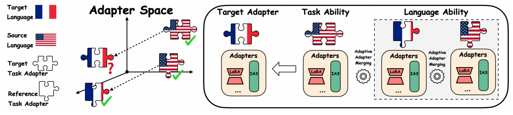

# AdaMergeX

This repository contains code for the paper "[AdaMergeX: Cross-Lingual Transfer with Large Language Models via Adaptive Adapter Merging](https://arxiv.org/pdf/2402.18913.pdf) ". Below is the workflow of AdaMergeX.




### Abstract

As an effective alternative to the direct finetuning on target tasks in specific languages, cross-lingual transfer addresses the challenges of limited training data by decoupling "task ability" and "language ability" by fine-tuning on the target task in the source language and another selected task in the target language, respectively. However, they fail to fully separate the task ability from the source language or the language ability from the chosen task. In this paper, we acknowledge the mutual reliance between task ability and language ability and direct our attention toward the gap between the target language and the source language on tasks. As the gap removes the impact of tasks, we assume that it remains consistent across tasks. Based on this assumption, we propose a new cross-lingual transfer method called AdaMergeX that utilizes adaptive adapter merging. By introducing a reference task, we can determine that the divergence of adapters fine-tuned on the reference task in both languages follows the same distribution as the divergence of adapters fine-tuned on the target task in both languages. Hence, we can obtain target adapters by combining the other three adapters. Furthermore, we propose a structureadaptive adapter merging method. Our empirical results demonstrate that our approach yields new and effective cross-lingual transfer, outperforming existing methods across all settings

## Data

To construct the training data for the reference task, i.e., casual language modeling, you can run `construct_dataset_lm.py`. In the folder `dataset_demo`, we show the template of dataset in Wikipedia

```json
[
  {
  "prompt": "Vulcan Airport is located immediately west of Vulcan, Alberta, Canada. The airport served until 2015 as the xxxxxxxxxx",
  "completion": "the"
  },
  ...
]
```

## Installation

The environment can be installed by running the following command at the root of this repository:

```
conda env create -f environment.yml
```

## Train

`train_lora.py` contains the code to fine-tune Llama by LoRA, and the fine-tuning setting is determined by the following code. Similar to the `train_ia3.py`. 

```python
peft_config = LoraConfig(
    r=8,
    lora_alpha=16,
    target_modules = [
        "q_proj",
        "v_proj",
        "o_proj",
        "gate_proj",
        "k_proj",
        "down_proj",
        "up_proj"
    ],
    lora_dropout=0.05,
    bias="none",
    task_type="CAUSAL_LM",
)
```

## Test

`test_combine_llama2.py` contains the code for merging models.
